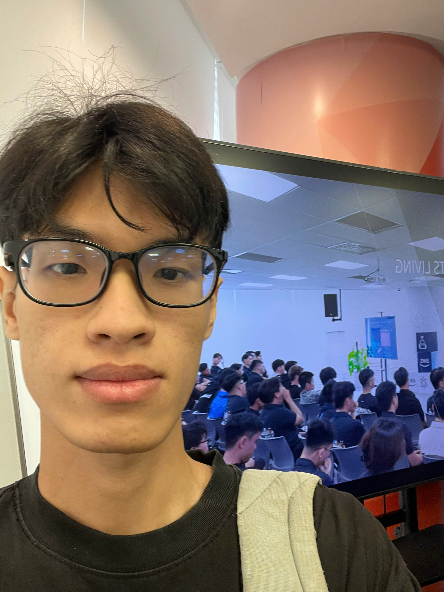

# Báo cáo tổng kết: Buổi trình bày sản phẩm sau Hackathon của chương trình FCAJ

*Lưu ý: tên sự kiện chính xác, ngày tổ chức và địa điểm sẽ được bổ sung sau.*

### Mục tiêu tham gia

- Lắng nghe các anh chị trong chương trình FCAJ trình bày sản phẩm đã xây dựng trong cuộc thi Hackathon
- Hiểu cách các giải pháp được thiết kế và kết quả đạt được sau cuộc thi
- Học hỏi kinh nghiệm thực tế của các anh chị khi xây dựng sản phẩm dưới áp lực thời gian của hackathon
- Có thêm cảm hứng và định hướng cho dự án/hackathon sắp tới của bản thân (nếu có)

### Diễn giả

- **Đội 3KA** – trình bày sản phẩm dựa trên AI agent để xử lý video/sự cố thời gian thực trên AWS
- **Đội Dream AI** – trình bày nền tảng điều phối nhiều AI agent xây dựng bằng Amazon Bedrock và agent runtime
- **Đội Plan V** – trình bày nền tảng tự động hóa kết hợp hạ tầng được cấp phát bằng Terraform, dịch vụ container hóa và các tính năng generative AI
- **Đội One Team** – trình bày hệ thống chatbot chăm sóc khách hàng kết nối các kênh nhắn tin (Zalo, WhatsApp và ứng dụng di động trong tương lai) với một AI agent backend xây dựng trên Amazon Bedrock AgentCore, cùng các lớp memory, dữ liệu và giám sát dành cho quản trị viên

### Nội dung nổi bật

#### Ba sản phẩm khác nhau, cùng chung một nền tảng

Dù mỗi nhóm giải quyết một bài toán khác nhau, các sản phẩm đều được xây dựng trên một tập hợp dịch vụ AWS tương tự nhau: API Gateway, Lambda, dịch vụ container (ECS/Fargate), lưu trữ (S3, DynamoDB, PostgreSQL) và các dịch vụ bảo mật/giám sát (WAF, Cognito, IAM, CloudWatch). Khi đặt cạnh nhau, có thể thấy rõ cùng một tập dịch vụ có thể được kết hợp theo rất nhiều cách khác nhau tùy vào mục đích của sản phẩm.

#### Generative AI được dùng như một phần thật sự của sản phẩm, không chỉ để trình diễn

Nhiều nhóm đã tích hợp generative AI (Amazon Bedrock, AI agent) trực tiếp vào logic cốt lõi của sản phẩm, thay vì chỉ thêm vào cho có. Điều này cho thấy các dịch vụ AI có thể kết hợp với các thành phần cloud truyền thống để giải quyết một vấn đề thực sự, chứ không chỉ để gây ấn tượng lúc demo.

#### Bài học từ những người đã thực sự trải qua hackathon

Vì các anh chị trình bày đã trải qua hackathon và giờ chia sẻ lại kết quả, phần trình bày không chỉ dừng ở kiến trúc mà còn tập trung vào những gì họ học được từ chính quá trình đó — điều gì hiệu quả, điều gì họ sẽ làm khác đi, và sản phẩm đã thay đổi ra sao so với bản nộp ban đầu trong hackathon.

### Bài học rút ra

- **Có mặt và bắt tay vào làm đã là một nửa chiến thắng.** Việc dám bắt đầu và kiên trì theo đến cùng quan trọng hơn việc chờ đợi một ý tưởng hoàn hảo.
- **Một sản phẩm nhỏ nhưng hoàn chỉnh có giá trị hơn một ý tưởng lớn nhưng dang dở.** Một giải pháp đơn giản chạy được trọn vẹn từ đầu đến cuối luôn giá trị hơn một ý tưởng tham vọng nhưng chưa bao giờ hoàn thành.
- **Con người gặp gỡ được quan trọng hơn cả giải thưởng.** Những kết nối, sự hướng dẫn từ mentor và những gì học được cùng nhau trong hành trình hackathon có giá trị lớn hơn kết quả cuộc thi.

### Áp dụng vào công việc

- Ưu tiên xây dựng một phiên bản chạy được tối thiểu trước, sau đó mới cải tiến dần, thay vì cố gắng thiết kế một hệ thống "hoàn hảo" ngay từ đầu.
- Tìm cách tích hợp các công cụ hỗ trợ AI vào dự án một cách thiết thực, có mục tiêu rõ ràng, theo những ví dụ các anh chị đã chia sẻ.
- Chủ động hơn trong việc kết nối với mentor và bạn cùng chương trình — xem những cuộc trò chuyện đó là một phần kết quả học được, chứ không chỉ là hoạt động phụ.

### Trải nghiệm sự kiện

Tham dự buổi trình bày sản phẩm **FCAJ x AABW** thực sự rất giá trị, giúp tôi có cái nhìn rõ ràng và cụ thể hơn nhiều về cách một ý tưởng hackathon trở thành sản phẩm thực sự hoạt động, khi các đội đã có thời gian nhìn lại. Những trải nghiệm chính bao gồm:

#### Học hỏi từ những người đã thực sự trải qua quá trình đó

* Các anh chị từ đội 3KA, Dream AI, Plan V và One Team chia sẻ thẳng thắn về hành trình hackathon của mình — không chỉ dừng ở kiến trúc cuối cùng, mà cả những điều đã hiệu quả, chưa hiệu quả, và những gì sẽ thay đổi nếu làm lại.
* Qua những câu chuyện sản phẩm thực tế đó, tôi hiểu sâu hơn cách AI agent, tích hợp theo hướng sự kiện (event-driven) và hạ tầng dạng infrastructure-as-code được áp dụng vào những bài toán thực tế, chứ không chỉ là ví dụ lý thuyết.

#### Tiếp cận nhiều hướng kỹ thuật khác nhau

* Việc quan sát bốn đội giải quyết bốn bài toán khác nhau giúp tôi hình dung rõ hơn cách cùng một tập dịch vụ AWS — API Gateway, Lambda, dịch vụ container, cơ sở dữ liệu được quản lý — có thể được sắp xếp theo nhiều cách rất khác nhau tùy vào sản phẩm.
* Học được cách AI agent có thể được điều phối và kết nối với các kênh bên ngoài (như chatbot của One Team) hoặc được gắn trực tiếp vào một pipeline xử lý (như hệ thống video/sự cố của 3KA).
* Hiểu được những sự đánh đổi mà mỗi đội phải chọn giữa tốc độ, phạm vi và độ sâu kỹ thuật dưới áp lực thời gian của hackathon.

#### Tận dụng các công cụ hỗ trợ AI hiện đại

* Tìm hiểu cách Amazon Bedrock và AgentCore được sử dụng xuyên suốt nhiều sản phẩm như một nền tảng thực tế để xây dựng AI agent, thay vì chỉ là một thử nghiệm riêng lẻ.
* Học được cách các đội kết hợp generative AI với các dịch vụ cloud truyền thống hơn (hàng đợi, lưu trữ, giám sát) để giữ cho sản phẩm ổn định, chứ không chỉ ấn tượng lúc demo.

#### Kết nối và trao đổi

* Sự kiện là cơ hội để trò chuyện trực tiếp với các đội trình bày và những người tham dự khác, trao đổi về các lựa chọn thiết kế và bài học rút ra.
* Được nghe nhiều góc nhìn khác nhau đặt cạnh nhau càng củng cố suy nghĩ rằng không có một cách "đúng duy nhất" để xây dựng sản phẩm — chỉ có những lựa chọn phù hợp với mục tiêu và ràng buộc của từng đội.

#### Bài học rút ra

* Có mặt và bắt tay vào làm quan trọng hơn việc chờ đợi một ý tưởng hoàn hảo.
* Một sản phẩm nhỏ nhưng hoàn chỉnh có giá trị hơn một ý tưởng tham vọng nhưng không bao giờ xong.
* Những kết nối và kiến thức học được cùng nhau trong một sự kiện như thế này thường có giá trị lớn hơn kết quả cuộc thi.
* Các công cụ AI như Amazon Bedrock AgentCore có thể giúp tăng tốc đáng kể việc xây dựng chức năng thực tế khi được tích hợp một cách có chủ đích vào kiến trúc sản phẩm.

#### Hình ảnh sự kiện

