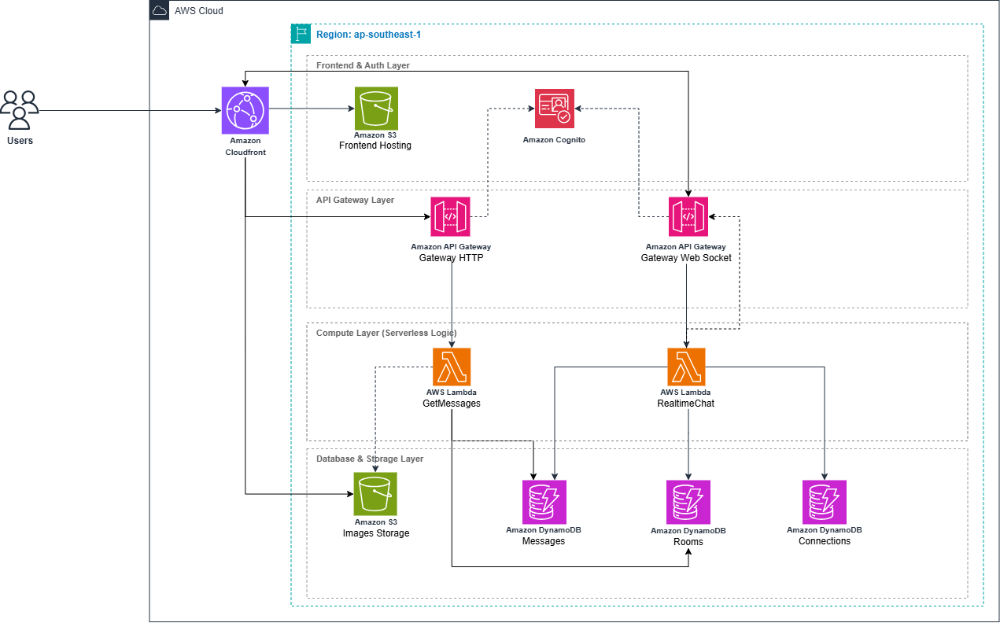

### Giới thiệu
Workshop này sẽ hướng dẫn bạn từng bước cách xây dựng một **Ứng dụng Chat thời gian thực với kiến trúc Serverless Hybrid** trên AWS.

Thay vì phụ thuộc vào các máy chủ truyền thống chạy 24/7 (như Amazon EC2), ứng dụng này áp dụng kiến trúc 100% Serverless (Không máy chủ). Cách tiếp cận này đảm bảo khả năng mở rộng tự động, không cần bảo trì máy chủ và tối ưu hóa chi phí (chỉ trả tiền cho những gì sử dụng). Hơn nữa, ứng dụng sử dụng thiết kế **Hybrid API**, tách biệt các yêu cầu dữ liệu tĩnh khỏi luồng giao tiếp thời gian thực để tối ưu cả hiệu suất lẫn chi phí.

### Sơ đồ kiến trúc

Dưới đây là kiến trúc tổng thể của hệ thống mà chúng ta sắp xây dựng:

### Luồng hoạt động của hệ thống

Hệ thống được phân tách thành các luồng dữ liệu cụ thể:
1. **Lưu trữ & Phân phối giao diện**: Giao diện ReactJS được lưu trữ trên **Amazon S3** và phân phối toàn cầu qua mạng lưới **Amazon CloudFront** nhằm mang lại tốc độ tải trang cực nhanh và bảo mật HTTPS.
2. **Xác thực người dùng**: Người dùng đăng ký và đăng nhập thông qua **Amazon Cognito**. Cognito quản lý phiên đăng nhập và cung cấp định danh an toàn cho các API.
3. **Luồng dữ liệu tĩnh (REST API)**: Khi người dùng mở một phòng chat, giao diện sẽ gọi **Amazon API Gateway (HTTP API)**. API này kích hoạt một hàm **AWS Lambda** để truy xuất lịch sử tin nhắn và danh sách người dùng từ cơ sở dữ liệu **Amazon DynamoDB**.
4. **Luồng dữ liệu thời gian thực (WebSocket API)**: Để nhắn tin tức thời, giao diện thiết lập một kết nối liên tục với **Amazon API Gateway (WebSocket API)**. Các tin nhắn gửi đi sẽ được hàm Lambda xử lý và phát sóng (broadcast) ngay lập tức đến tất cả những người đang online trong phòng đó.
5. **Tải tệp đa phương tiện**: Thay vì đẩy các file ảnh nặng qua Lambda, hệ thống sẽ xin một thẻ **Presigned URL** từ S3. Giao diện sau đó tải ảnh trực tiếp lên S3 bucket, giúp giảm tải hoàn toàn cho backend và tiết kiệm chi phí băng thông.

Trong các phần tiếp theo, chúng ta sẽ lần lượt triển khai các thành phần này. Bắt đầu thôi!