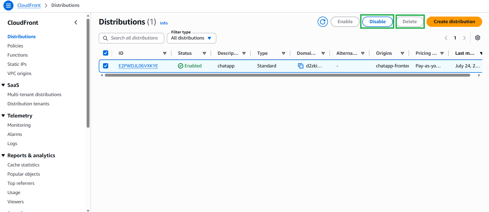
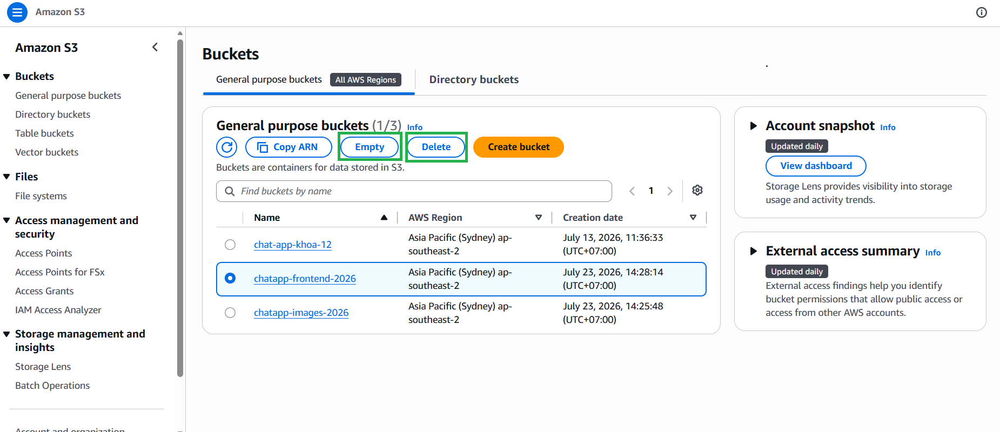
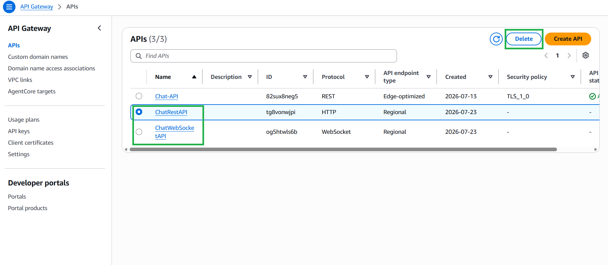
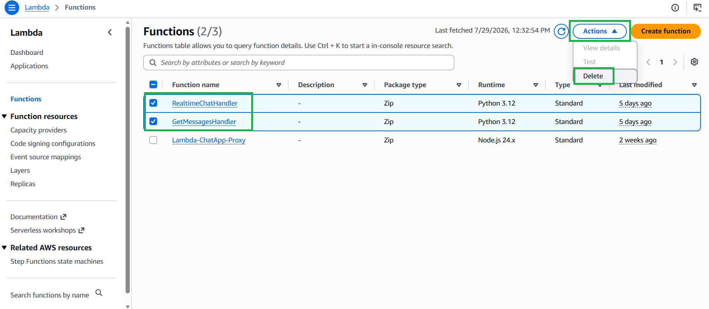
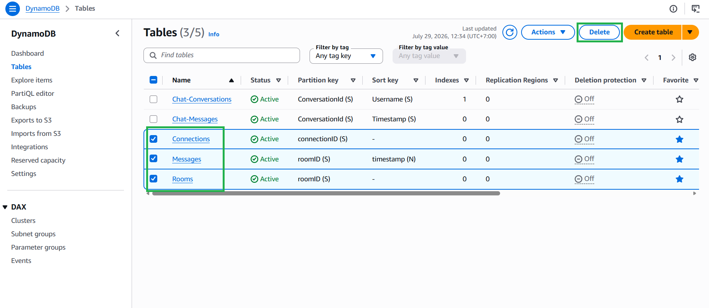
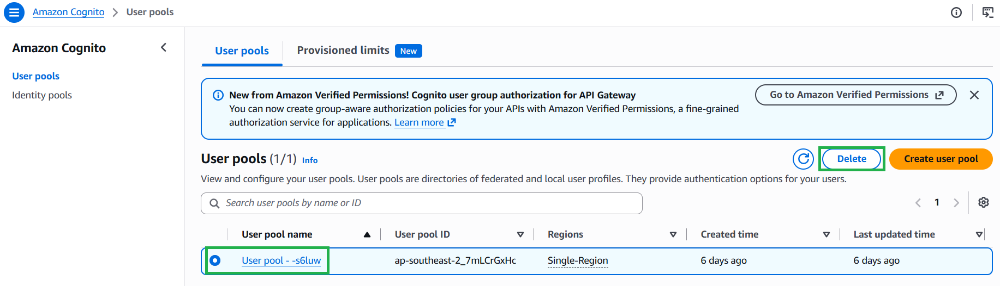
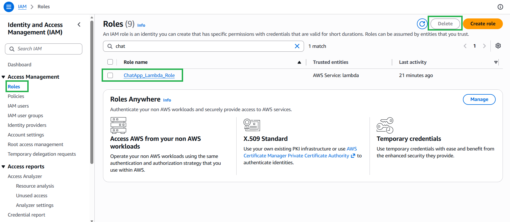

### Objective
Congratulations on successfully building the Serverless Hybrid Real-time Chat App! 

To avoid incurring unexpected charges on your AWS bill after completing this workshop, it is essential to delete all the resources we created. **Always delete resources from the outside in** (Frontend -> APIs -> Backend -> Database) to avoid dependency errors.

---

### Step-by-Step Cleanup Guide

**1. Amazon CloudFront**
* Go to the **CloudFront** console.
* Select your distribution and click **Disable**. 
* *Note: You must wait a few minutes for the status to change to "Disabled" before you can select it again and click **Delete**.*

**2. Amazon S3 (Hosting & Image Storage)**
* Go to the **S3** console.
* You cannot delete a bucket that contains files. First, select your frontend bucket, click **Empty**, and confirm the deletion of all objects.
* Once emptied, select the bucket again and click **Delete**.
* Repeat the exact same process (Empty -> Delete) for your image storage bucket.

**3. Amazon API Gateway**
* Go to the **API Gateway** console.
* Select your **HTTP API** (`ChatRestAPI`) and click **Delete**.
* Select your **WebSocket API** (`ChatWebSocketAPI`) and click **Delete**.

**4. AWS Lambda**
* Go to the **Lambda** console.
* Select `RealtimeChatHandler` and click **Actions** -> **Delete**.
* Select `GetMessagesHandler` and click **Actions** -> **Delete**.

**5. Amazon DynamoDB**
* Go to the **DynamoDB** console and select **Tables**.
* Select the `Connections` table and click **Delete**.
* Select the `Rooms` table and click **Delete**.
* Select the `Messages` table and click **Delete**.

**6. Amazon Cognito**
* Go to the **Cognito** console and select **User pools**.
* Select your user pool (e.g., `ChatAppClient`) and click **Delete**. You will need to type the user pool name to confirm.

**7. AWS IAM**
* Go to the **IAM** console and select **Roles**.
* Search for `ChatApp_Lambda_Role`, select it, and click **Delete**.

***Workshop Complete! Thank you for following along with this Serverless Architecture journey.***