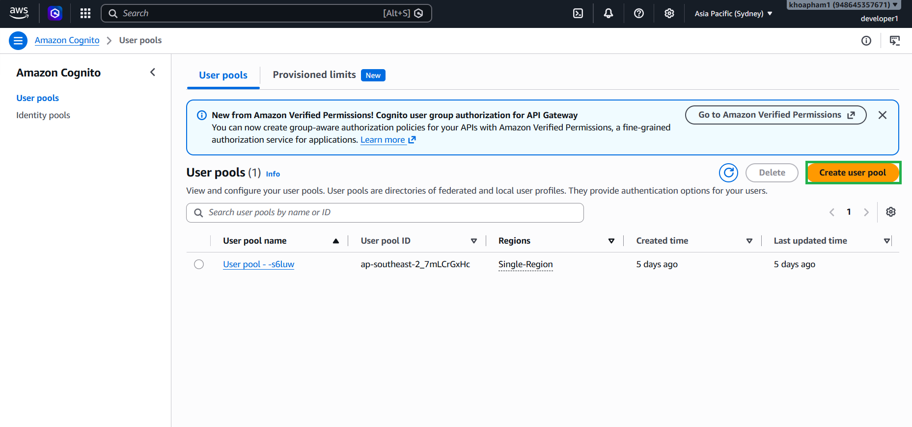
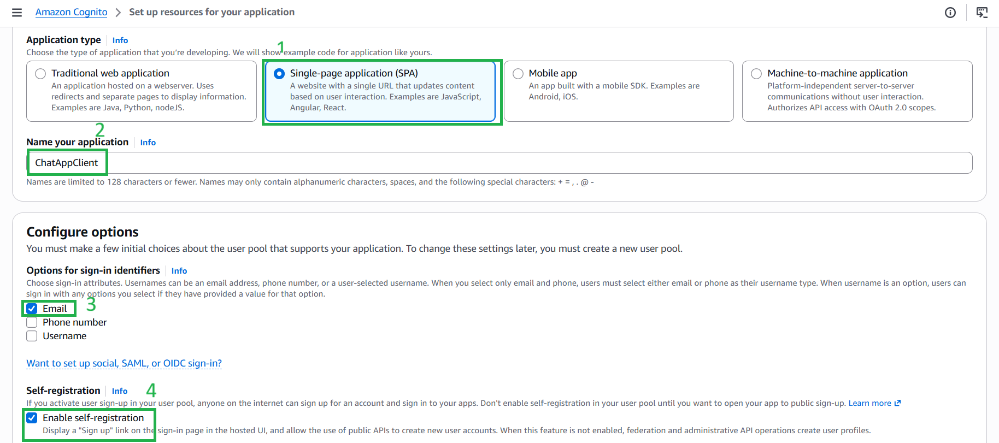
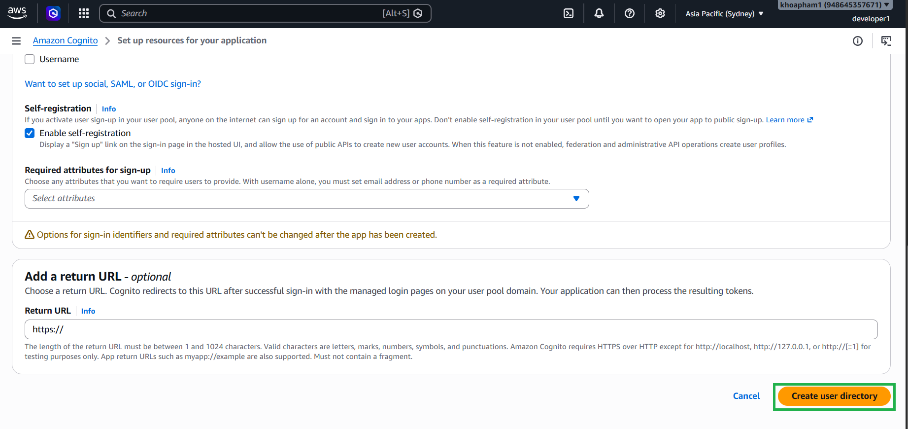

#### 5.3.1. Tạo User Pool (Hồ sơ người dùng)

1. Truy cập dịch vụ **Amazon Cognito** trên AWS Management Console.
2. Nhấn vào **Create user pool**.

3. Tại bước *Define your application*, chọn **Single-page application (SPA)** vì chúng ta đang phát triển bằng ReactJS.
4. Đặt tên cho ứng dụng (Ví dụ: `ChatAppClient`).
5. Tại mục *Options for sign-in identifiers*, đánh dấu chọn **Email**. Điều này bắt buộc người dùng sử dụng email làm tên đăng nhập.
6. Tại mục *Self-registration*, đánh dấu chọn **Enable self-registration** (Cho phép tự do đăng ký) để người dùng mới có thể tự tạo tài khoản từ giao diện web.

7. Nhấn vào **Create user directory**

