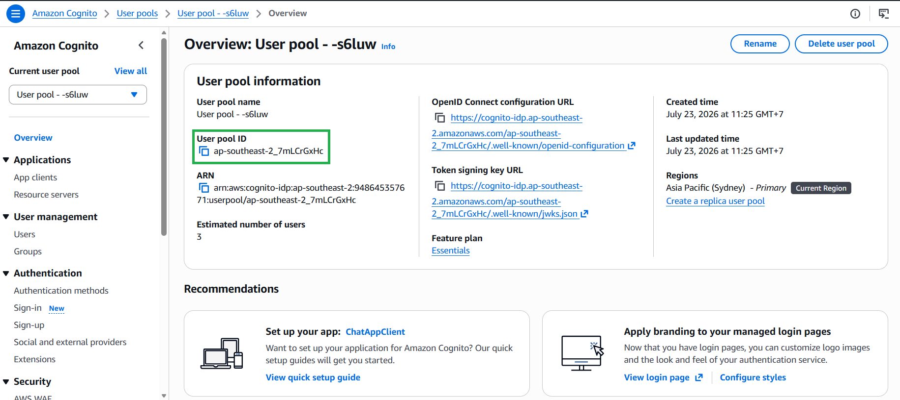
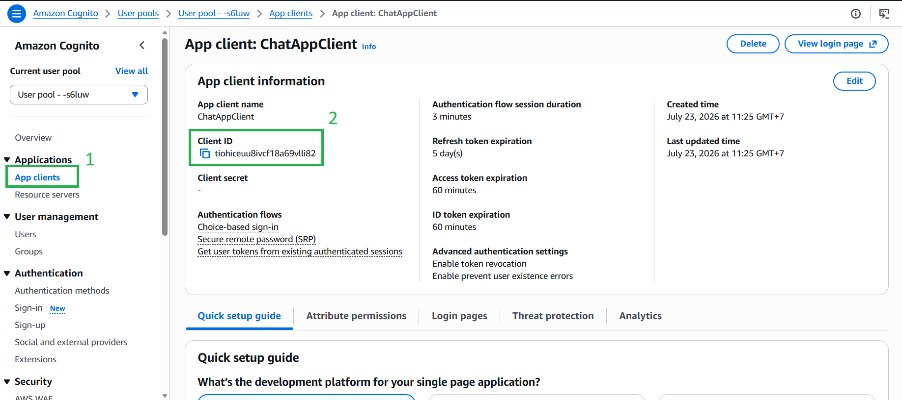

#### 5.3.2. Lấy thông tin & Tích hợp vào Frontend

Sau khi User Pool được tạo thành công, bạn cần lấy các mã định danh của nó để kết nối với ứng dụng React.

1. Tại trang tổng quan của Cognito, sao chép **User Pool ID** (Có dạng `ap-southeast-2_xxxxxxxxx`).


2. Chuyển sang tab **App integration** (Tích hợp ứng dụng), cuộn xuống phần *App clients*, và sao chép **Client ID**.



3. Trong mã nguồn React (`App.jsx`), cài đặt thư viện AWS Amplify (`npm install aws-amplify @aws-amplify/ui-react`) và cấu hình nó bằng các mã ID vừa lấy được:

```javascript
import { Amplify } from 'aws-amplify';
import { withAuthenticator } from '@aws-amplify/ui-react';
import '@aws-amplify/ui-react/styles.css';

// Cấu hình Xác thực Cognito
Amplify.configure({
  Auth: {
    Cognito: {
      userPoolId: 'ĐIỀN_USER_POOL_ID_CỦA_BẠN_VÀO_ĐÂY', 
      userPoolClientId: 'ĐIỀN_CLIENT_ID_CỦA_BẠN_VÀO_ĐÂY', 
    }
  }
});