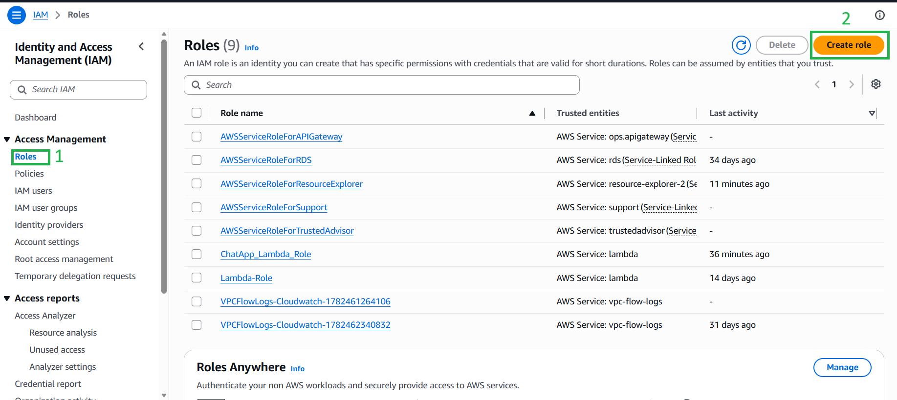
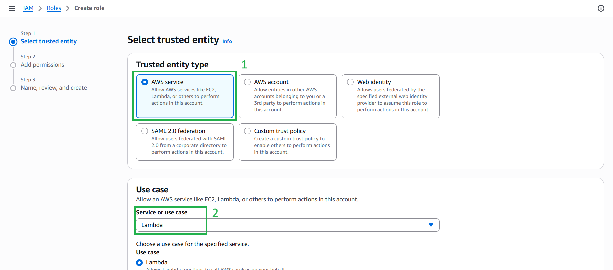
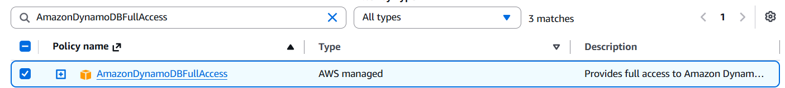
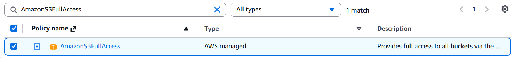
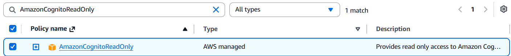
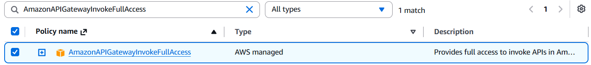
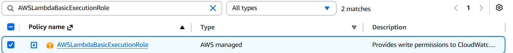
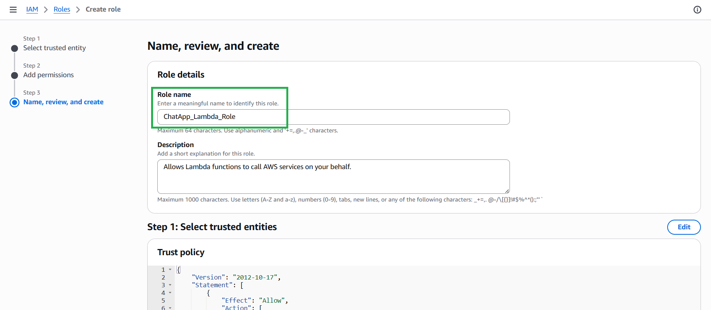
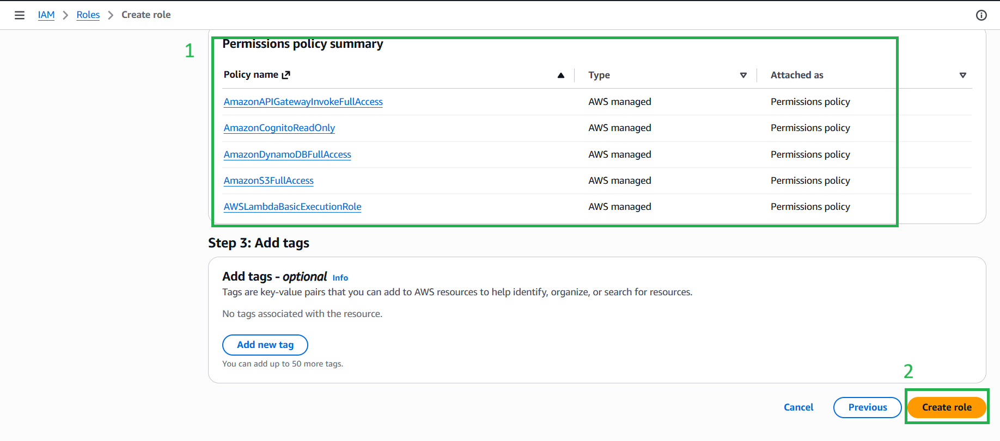

#### 5.5.1. Thiết lập Bảo mật IAM Role

Trước khi tạo hàm Lambda, chúng ta phải cấp cho nó những quyền chính xác để có thể tương tác với các dịch vụ AWS khác.

1. Vào dịch vụ **IAM** trên AWS Console, chọn **Roles**, và nhấn **Create role**.

2. Chọn **AWS service** làm thực thể tin cậy (trusted entity) và **Lambda** ở mục use case.

3. Gắn các quyền (policies) sau vào Role:
   * `AmazonDynamoDBFullAccess` *(Để đọc/ghi dữ liệu chat)*
   * `AmazonS3FullAccess` *(Để tạo Presigned URL up ảnh)*
   * `AmazonCognitoReadOnly` *(Để lấy danh sách user từ Cognito)*
   * `AmazonAPIGatewayInvokeFullAccess` *(Để gửi tin nhắn WebSocket ngược về trình duyệt)*
   * `AWSLambdaBasicExecutionRole` *(Để ghi log hệ thống lên CloudWatch)*

4. Nhấn vào **Next**
5. Đặt tên Role là **`ChatApp_Lambda_Role`**, review lại **Permissions policies** và nhấn tạo.

