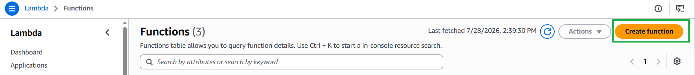
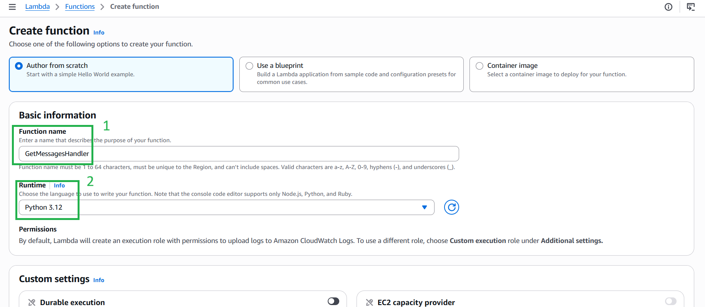
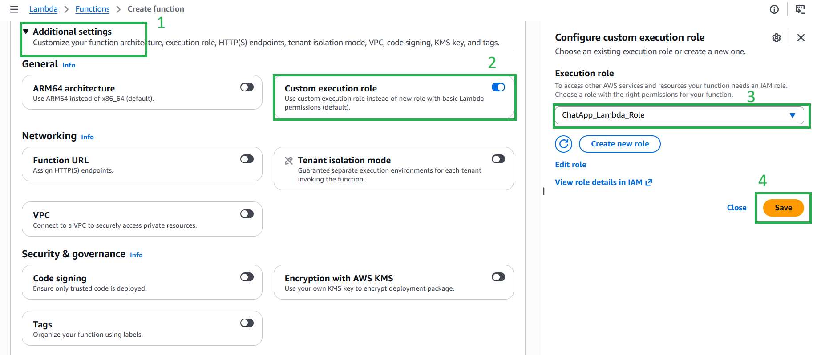

#### 5.5.2. Hàm Lambda 1: REST API (`GetMessagesHandler`)

Hàm này xử lý các yêu cầu tĩnh: lấy lịch sử tin nhắn, lấy danh sách phòng, lấy danh sách user từ Cognito và sinh thẻ Upload ảnh tạm thời (S3 Presigned URL).

1. Vào **AWS Lambda**, nhấn **Create function**.

2. Tên hàm: **`GetMessagesHandler`**, chọn ngôn ngữ **Python 3.12**, và gắn cái Role **`ChatApp_Lambda_Role`** vừa tạo.



3. Dán mã nguồn Python bên dưới vào và nhấn **Deploy**.
*(Đừng quên sửa `YOUR_S3_BUCKET_NAME` thành tên bucket kho ảnh S3 của bạn)*:

```python
import json
import boto3
import uuid
from boto3.dynamodb.conditions import Key

dynamodb = boto3.resource('dynamodb')
table = dynamodb.Table('Messages')
rooms_table = dynamodb.Table('Rooms')
cognito = boto3.client('cognito-idp')
s3_client = boto3.client('s3')
IMAGE_BUCKET_NAME = 'YOUR_S3_BUCKET_NAME'

def lambda_handler(event, context):
    try:
        params = event.get('queryStringParameters') or {}
        action = params.get('action')
        requester = params.get('user', '') 

        if action == 'getUploadUrl':
            file_name = params.get('fileName', 'image.png')
            file_type = params.get('fileType', 'image/png')
            
            unique_filename = f"{str(uuid.uuid4())[:8]}-{file_name}"
            
            presigned_url = s3_client.generate_presigned_url(
                'put_object',
                Params={'Bucket': IMAGE_BUCKET_NAME, 'Key': unique_filename, 'ContentType': file_type},
                ExpiresIn=300
            )
            
            image_url = f"https://{IMAGE_BUCKET_NAME}.s3.amazonaws.com/{unique_filename}"
            
            return {
                'statusCode': 200,
                'headers': {'Access-Control-Allow-Origin': '*'},
                'body': json.dumps({'uploadURL': presigned_url, 'imageURL': image_url})
            }

        if action == 'getAllUsers':
            user_pool_id = params.get('userPoolId')
            response = cognito.list_users(UserPoolId=user_pool_id, Limit=60)
            users_list = []
            for u in response.get('Users', []):
                email = u.get('Username')
                for attr in u.get('Attributes', []):
                    if attr['Name'] == 'email': email = attr['Value']
                users_list.append(email)
            return {'statusCode': 200, 'headers': {'Access-Control-Allow-Origin': '*'}, 'body': json.dumps(users_list)}

        if action == 'getRooms':
            response = rooms_table.scan()
            all_rooms = response.get('Items', [])
            my_rooms = []
            for r in all_rooms:
                members_str = r.get('members', '')
                if not members_str: my_rooms.append(r)
                else:
                    members_list = [m.strip() for m in members_str.split(',')]
                    if requester in members_list: my_rooms.append(r)
            return {'statusCode': 200, 'headers': {'Access-Control-Allow-Origin': '*'}, 'body': json.dumps(my_rooms)}
            
        room_id_query = params.get('roomID', 'global')
        if room_id_query != 'global':
            room = rooms_table.get_item(Key={'roomID': room_id_query}).get('Item')
            if room and room.get('members'):
                if requester not in [m.strip() for m in room.get('members').split(',')]:
                    return {'statusCode': 403, 'headers': {'Access-Control-Allow-Origin': '*'}, 'body': '[]'} 

        response = table.query(KeyConditionExpression=Key('roomID').eq(room_id_query), ScanIndexForward=True)
        return {'statusCode': 200, 'headers': {'Access-Control-Allow-Origin': '*', 'Access-Control-Allow-Methods': 'GET, OPTIONS'}, 'body': json.dumps(response.get('Items', []), default=str)}
        
    except Exception as e:
        return {'statusCode': 500, 'headers': {'Access-Control-Allow-Origin': '*'}, 'body': json.dumps({'error': str(e)})}