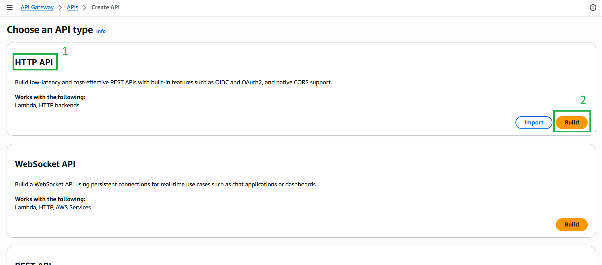
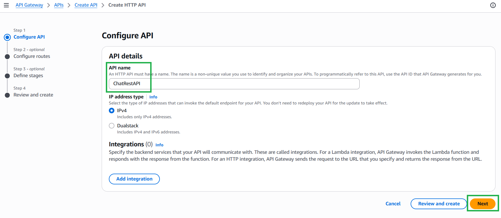
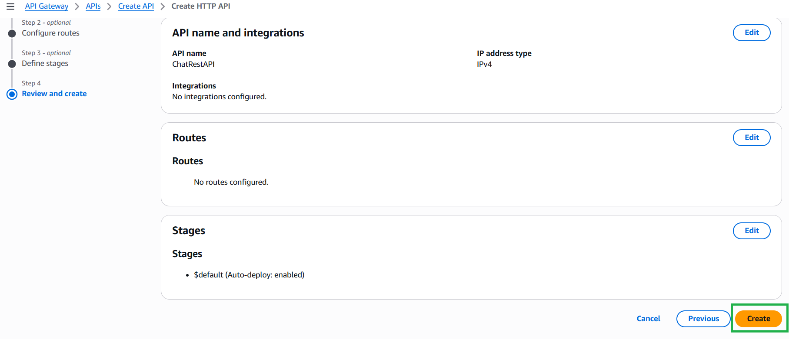
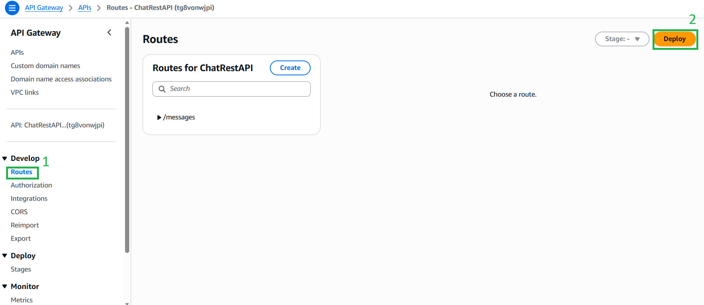
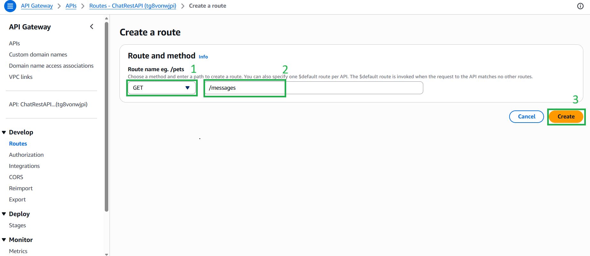
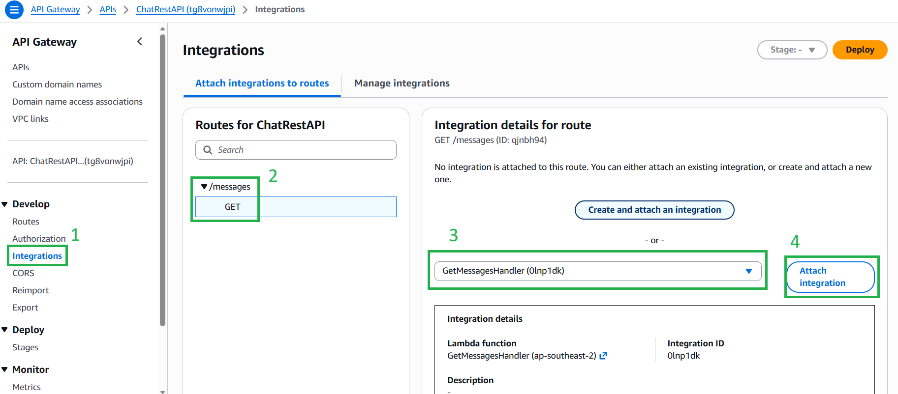
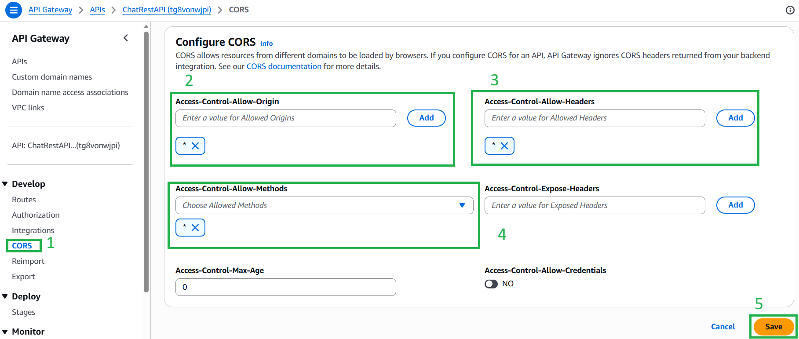

#### 5.6.1. Create the HTTP API (REST)

The HTTP API is used to fetch chat history, room lists, user lists, and to generate S3 Presigned URLs.

1. Navigate to **API Gateway** in the AWS Console, click **Create API** and click **Build** under **HTTP API**.

2. Name the API (e.g., `ChatRestAPI`) and proceed to create it.

3. After create the API, on the left menu, select **Routes** and click **Create**.

4. Set the Method to **GET** and the Path to `/messages`, then click Create.

5. Go to **Integrations**, select the `GET /messages` route, and click **Attach integration** -> **Create and attach an integration**.
6. Choose **Lambda function** as the integration type, select your `GetMessagesHandler` function, and click Create.

**Crucial Step: Configure CORS**
Since the React frontend is hosted on a different domain, we must enable Cross-Origin Resource Sharing (CORS) to prevent browser security blocks.
* Go to **CORS** on the left menu.
* Set **Access-Control-Allow-Origins** to `*` (Allow all).
* Set **Access-Control-Allow-Methods** to `*` (Allow all).
* Set **Access-Control-Allow-Headers** to `*` (Allow all).
* Click **Save**.

