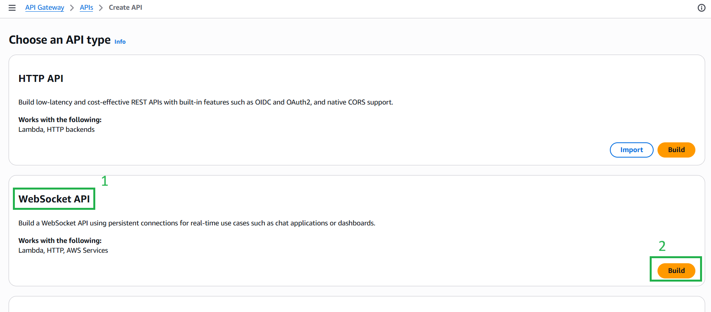
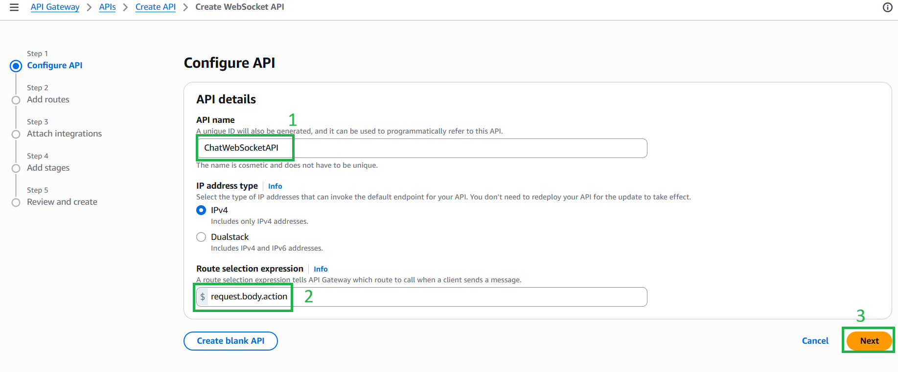
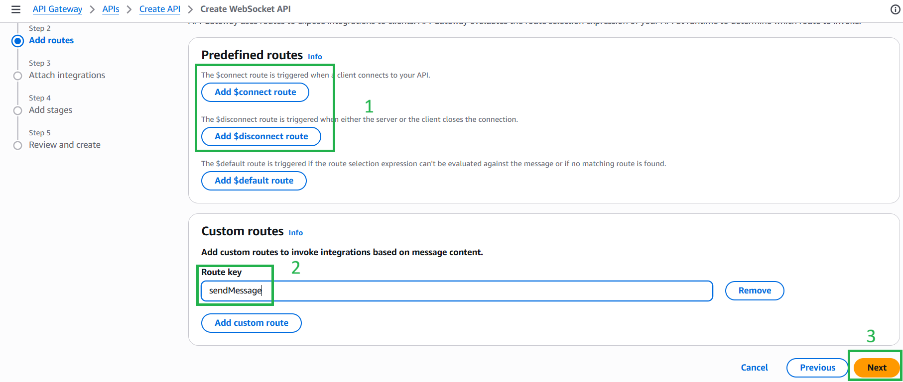
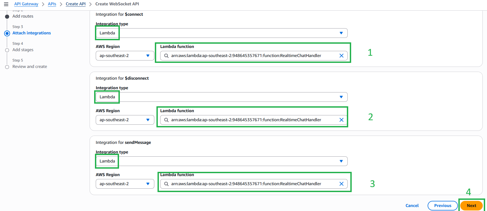
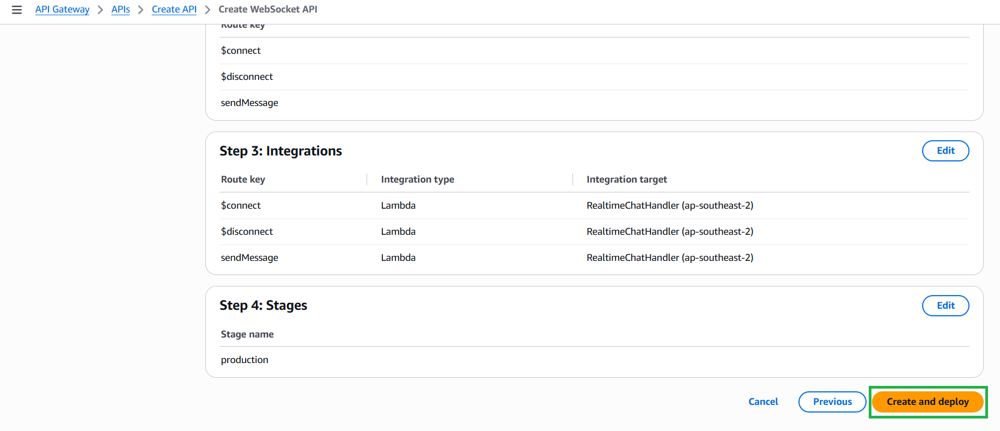

#### 5.6.2. Create the WebSocket API

The WebSocket API maintains persistent connections to broadcast messages in real-time.

1. Go back to the **API Gateway** dashboard, click **Create API** and click **Build** under **WebSocket API**.

2. Name the API (e.g., `ChatWebSocketAPI`).
3. Set the **Route selection expression** exactly to: `$request.body.action`. *(This tells the API how to route incoming messages based on the JSON body).*

4. Click Next. In the **Add routes** step, in the **Custom routes**, click **Add route** and type `sendMessage`. (The `$connect` and `$disconnect` routes are included by default).

5. In the **Attach integrations** step, set the Integration type to **Lambda** for all three routes (`$connect`, `$disconnect`, and `sendMessage`), and select the `RealtimeChatHandler` function for each.

6. Continue to the end and click **Create and deploy**.

