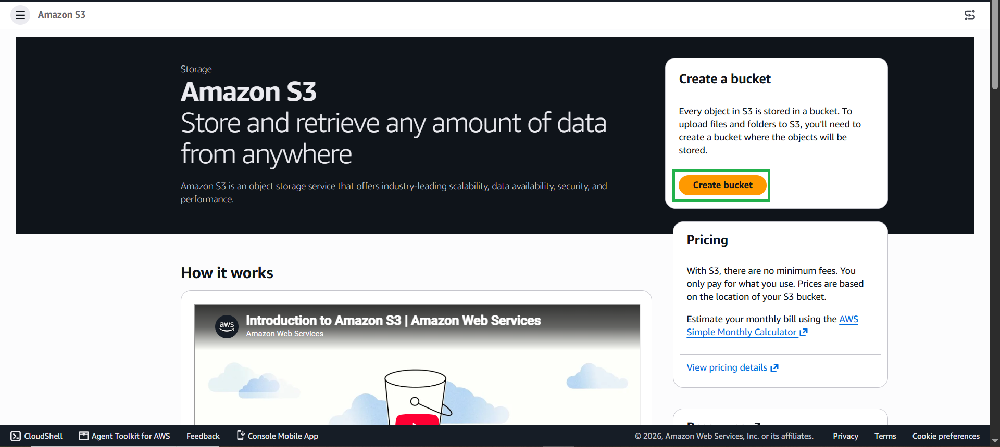
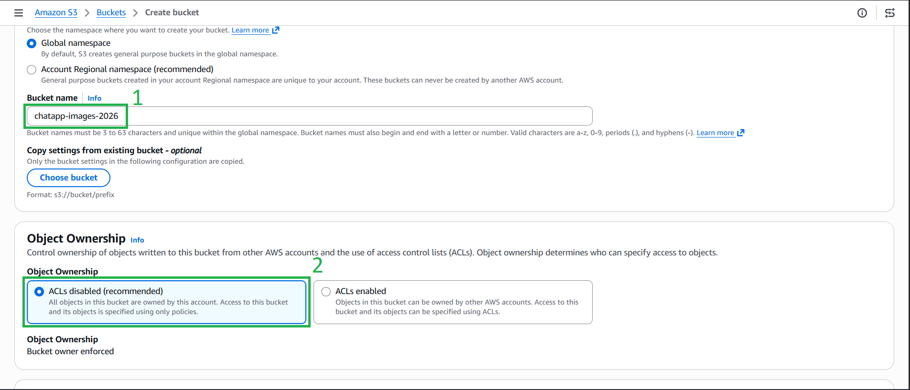
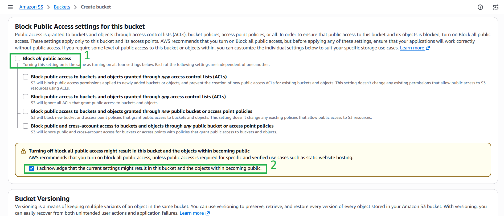
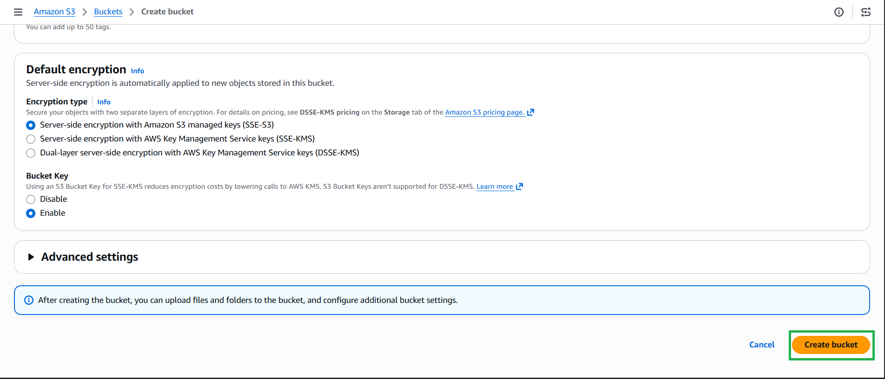

#### 5.7.1. Create the S3 Bucket
1. Navigate to the **Amazon S3** service in the AWS Console and click **Create bucket**.

2. **Bucket name:** Enter a globally unique name (e.g., `chatapp-images-2026`). Save this name, as you will need it later.

3. **Object Ownership:** Select **ACLs disabled (recommended)**.

4. **Block Public Access settings:** 
   * **Uncheck** the *Block all public access* option.
   * Check the acknowledgment box warning that objects might become public. (We need this so users can view the images in the chat).

5. Scroll to the bottom and click **Create bucket**.

