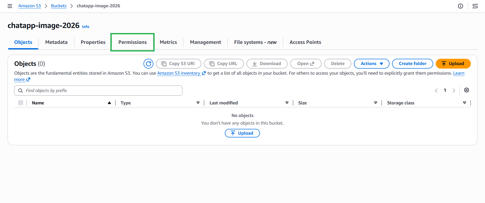
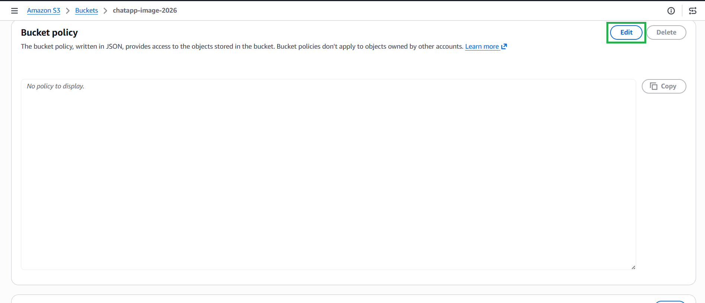
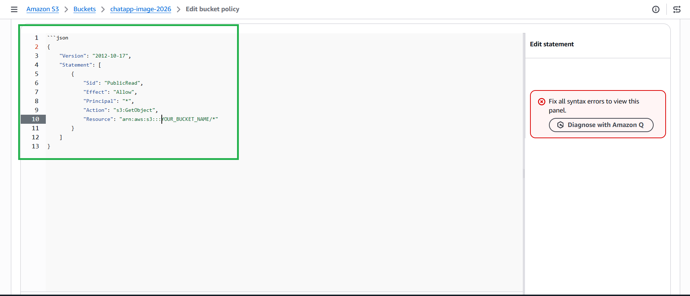
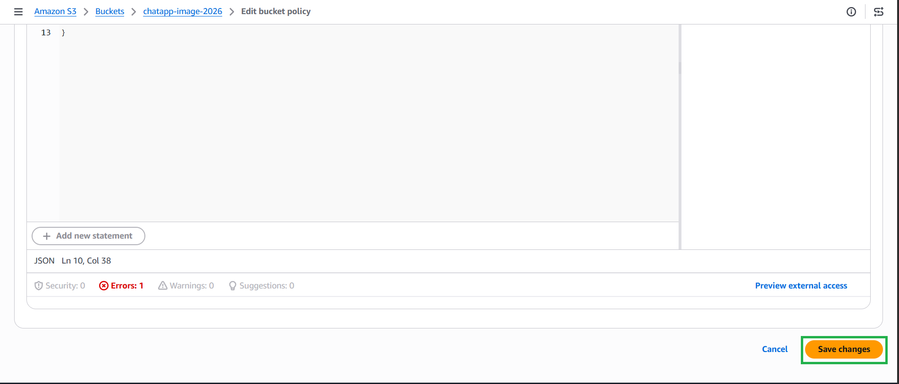

#### 5.7.2. Configure Bucket Policy (Public Read)

We need to allow browsers to read and display the images stored in this bucket.

1. Click on your newly created bucket and navigate to the **Permissions** tab.


2. Scroll down to **Bucket policy** and click **Edit**.


3. Paste the following JSON policy. **Important: Replace `YOUR_BUCKET_NAME` with your actual bucket name.**

```json
{
    "Version": "2012-10-17",
    "Statement": [
        {
            "Sid": "PublicRead",
            "Effect": "Allow",
            "Principal": "*",
            "Action": "s3:GetObject",
            "Resource": "arn:aws:s3:::YOUR_BUCKET_NAME/*"
        }
    ]
}
```


4.  Click Save changes.
