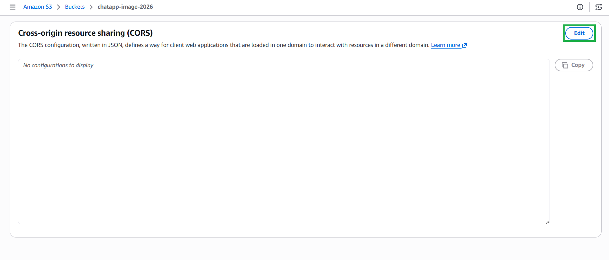
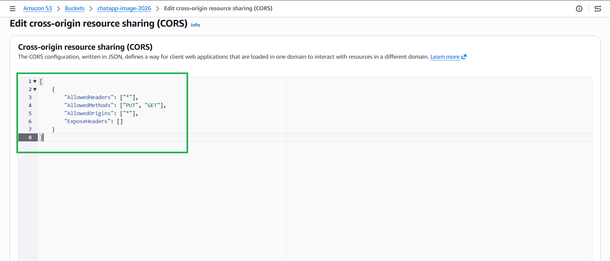
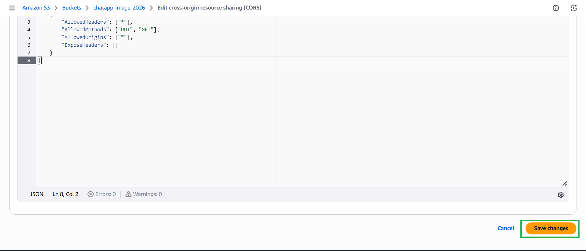

####5.7.3. Cấu hình CORS (Cross-Origin Resource Sharing)

Nếu không có CORS, trình duyệt sẽ chặn không cho phép Frontend gửi file trực
tiếp lên S3.

1.  Vẫn ở tab Permissions, cuộn xuống dưới cùng để tìm mục Cross-origin resource
    sharing (CORS).


2.  Nhấn Edit và dán cấu hình JSON sau đây:

```json
[
    {
        "AllowedHeaders": ["*"],
        "AllowedMethods": ["PUT", "GET"],
        "AllowedOrigins": ["*"],
        "ExposeHeaders": []
    }
]
```


3.  Nhấn Save changes.
