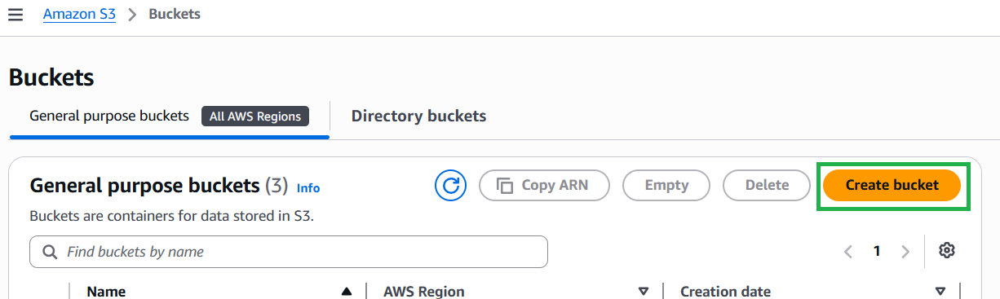
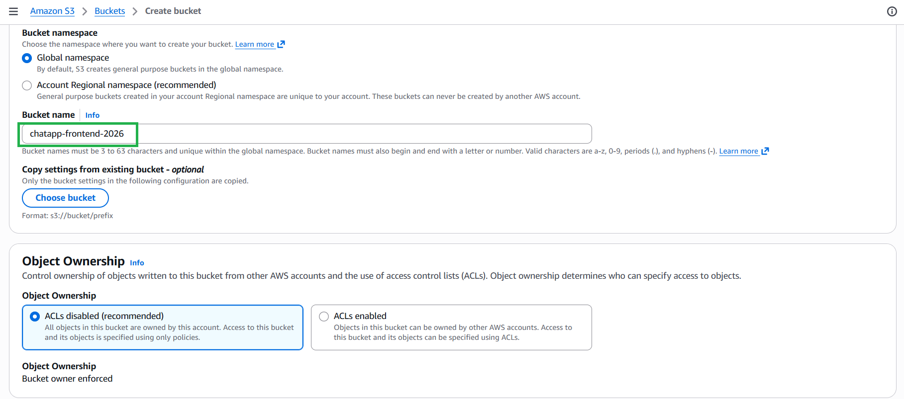
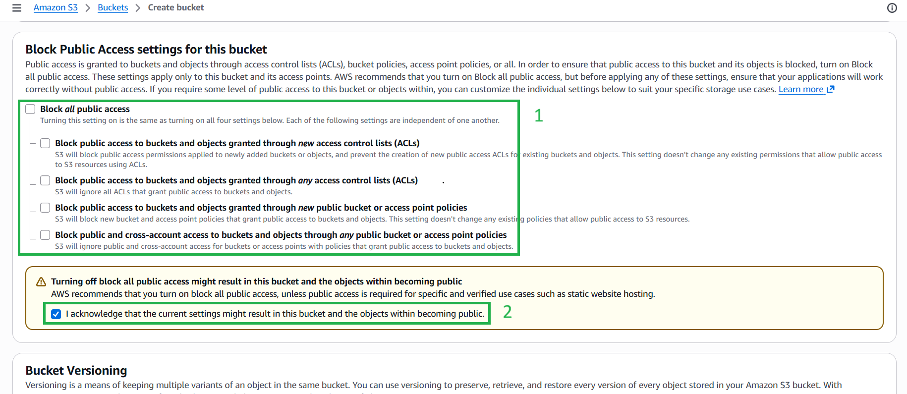
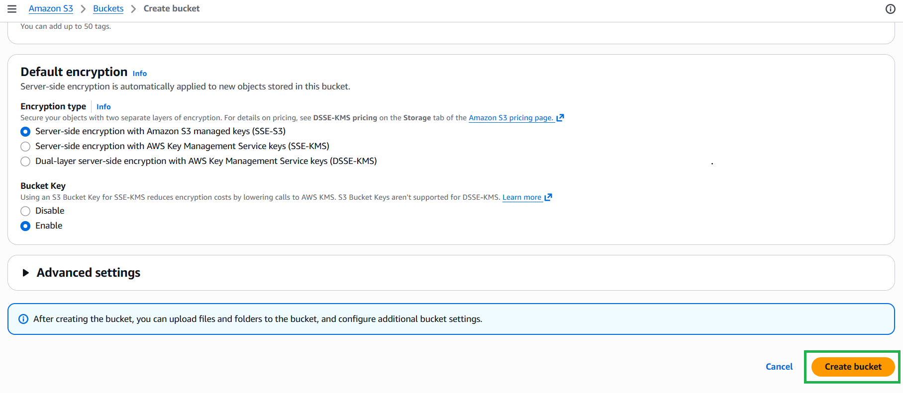

#### 5.8.2. Tạo Bucket S3 cho Hosting

1. Truy cập dịch vụ **Amazon S3** và nhấn **Create bucket**.

2. **Bucket name:** Nhập một tên duy nhất trên toàn cầu (VD: `chatapp-frontend-2026`).

3. **Cài đặt Block Public Access:** Bỏ chọn *Block all public access* và đánh dấu vào ô xác nhận cảnh báo.

4. Nhấn **Create bucket**.

