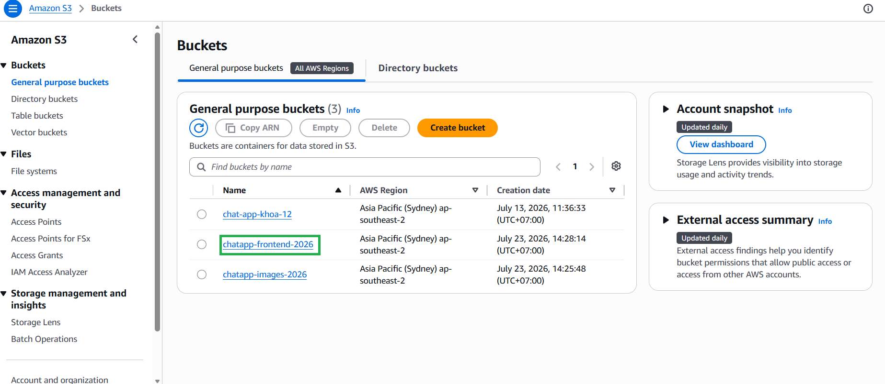
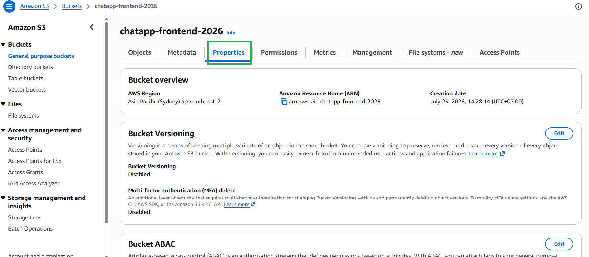
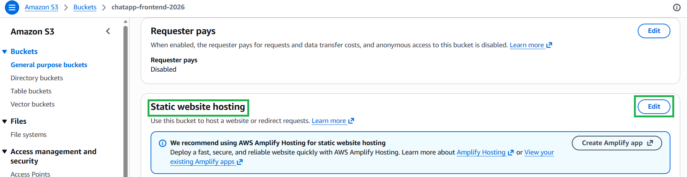
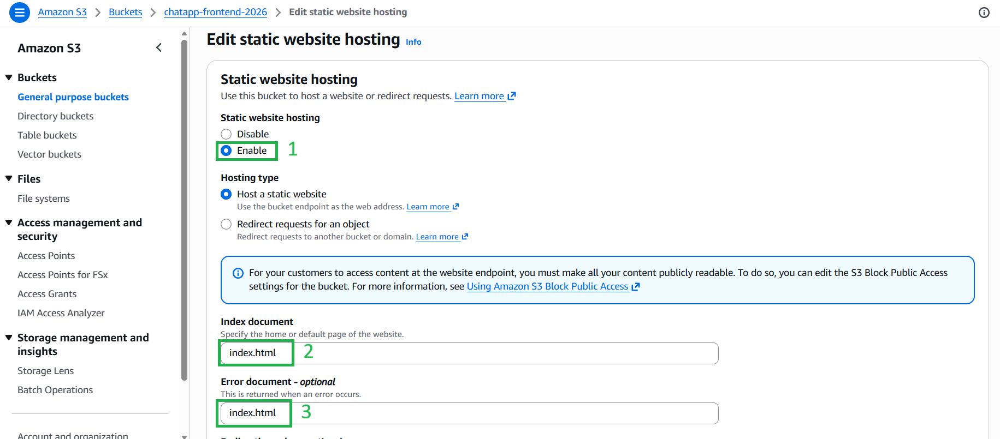
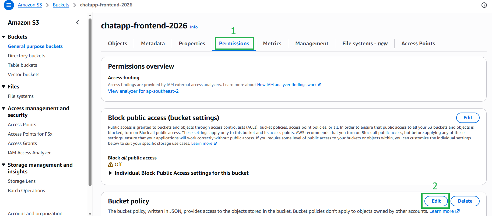

#### 5.8.3. Bật tính năng Web Hosting & Cấu hình Bucket Policy
1. Bấm vào bucket frontend bạn vừa tạo và chuyển sang tab **Properties** (Thuộc tính).

2. Cuộn xuống cuối trang và nhấn **Edit** tại mục **Static website hosting**.



3. Chọn **Enable** (Bật).
4. Ở cả 2 ô **Index document** và **Error document**, hãy điền `index.html`. *(Việc điền error document là index.html là bắt buộc đối với các ứng dụng Single-Page Application (SPA) như React để khi người dùng f5 không bị lỗi 404).*


5. Nhấn **Save changes**. Hãy copy lại đường link **Bucket website endpoint** màu xanh hiển thị ở đây.
6. Chuyển sang tab **Permissions** (Quyền). Cuộn xuống mục **Bucket policy**, nhấn **Edit**, và dán mã JSON sau *(nhớ thay `YOUR_FRONTEND_BUCKET_NAME` bằng tên bucket thực tế của bạn)*:


```JSON
{
    "Version": "2012-10-17",
    "Statement": [
        {
            "Sid": "PublicRead",
            "Effect": "Allow",
            "Principal": "*",
            "Action": "s3:GetObject",
            "Resource": "arn:aws:s3:::YOUR_FRONTEND_BUCKET_NAME/*"
        }
    ]
}
```

7. Nhấn **Save changes**.
