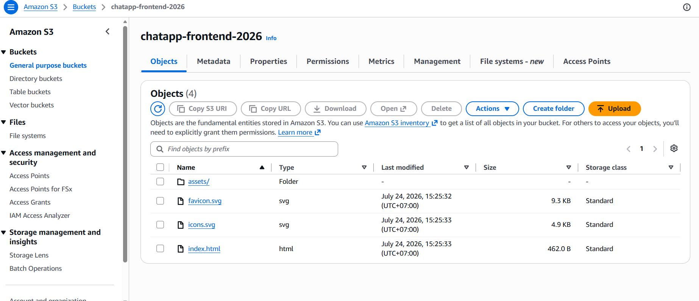

#### 5.8.4. Upload Files
1. Go to the **Objects** tab in your bucket and click **Upload**.
2. Open the **dist** folder on your computer. **Select all the files and folders INSIDE the `dist` folder** (do not upload the dist folder itself, just its contents like `index.html` and the `assets` folder).
3. Drag and drop them into the S3 interface and click **Upload**.

If you visit the **Bucket website endpoint** you noted earlier, you will see your web application running live! In the next step, we will add CloudFront to provide a custom domain and HTTPS security.