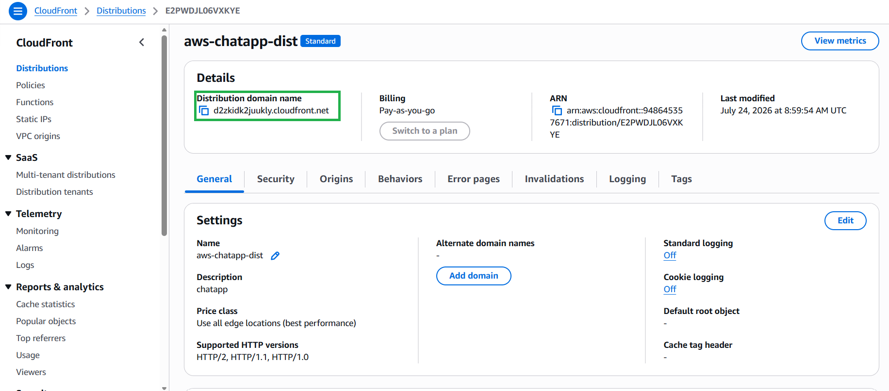
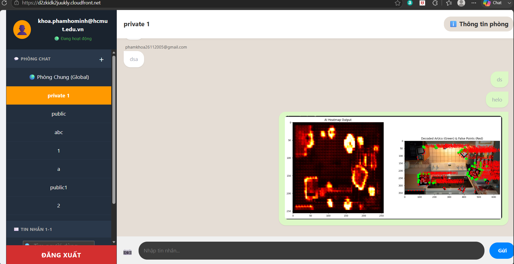

#### 5.9.2. Trải nghiệm Ứng dụng Thực tế

After clicking create, you will be redirected to the distribution's detail page. 

Sau khi nhấn tạo, bạn sẽ được đưa đến trang chi tiết của distribution.

1. Hãy tìm mục **Distribution domain name**. Nó sẽ có dạng tương tự như `https://d123456789.cloudfront.net`.
2. Kiểm tra trạng thái **Last modified**. Nó sẽ hiển thị là `Deploying`.
3. Vui lòng chờ khoảng 3 đến 5 phút cho đến khi quá trình phân phối hoàn tất (trạng thái đổi thành ngày giờ cụ thể).

Khi quá trình deploy kết thúc, hãy copy Domain Name của CloudFront và dán vào trình duyệt của bạn.

**Xin chúc mừng!** 🎉 Ứng dụng Serverless Hybrid Real-time Chat của bạn hiện đã chính thức trực tuyến trên Internet, được bảo mật tuyệt đối và sẵn sàng phục vụ hàng triệu người dùng!

